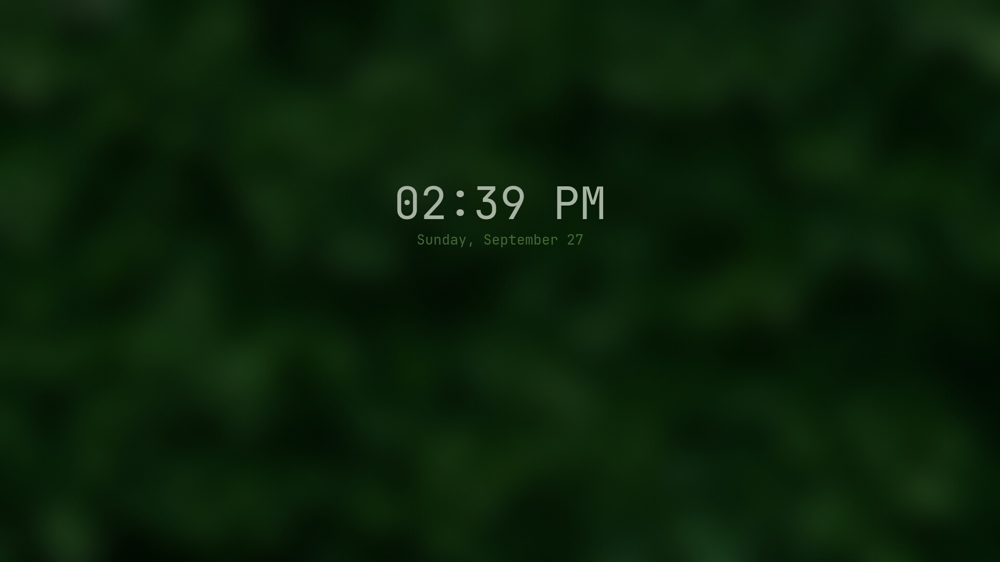
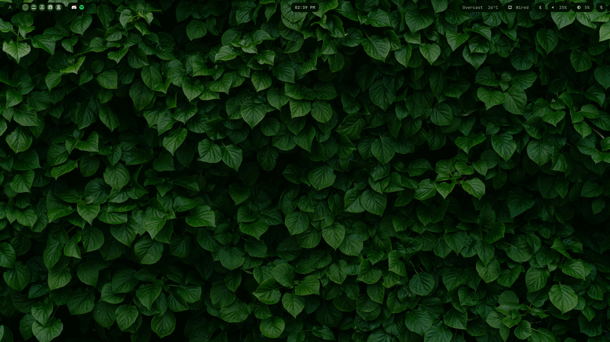
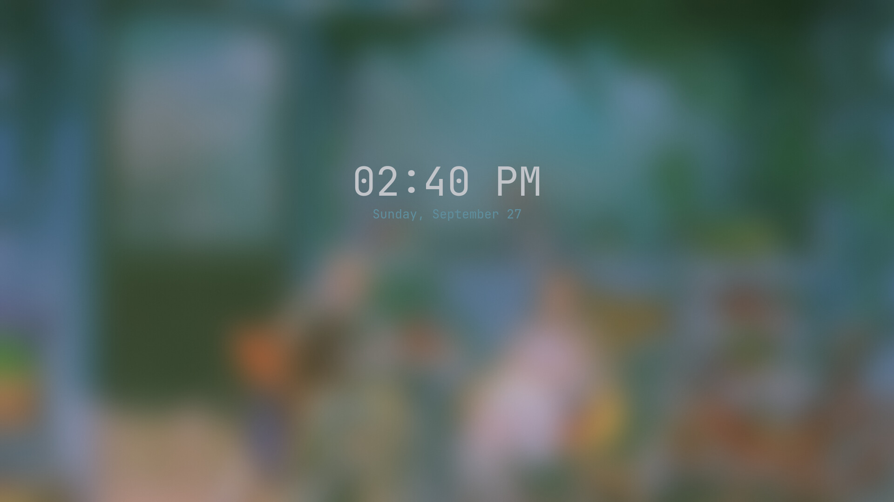
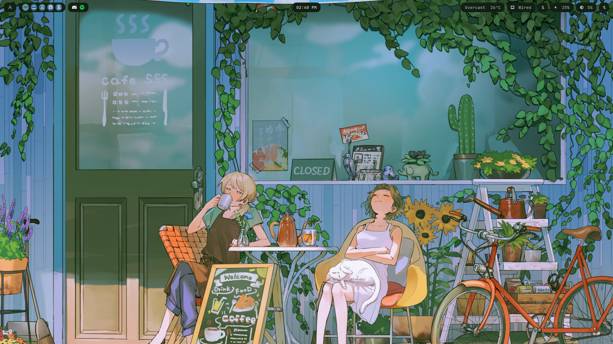
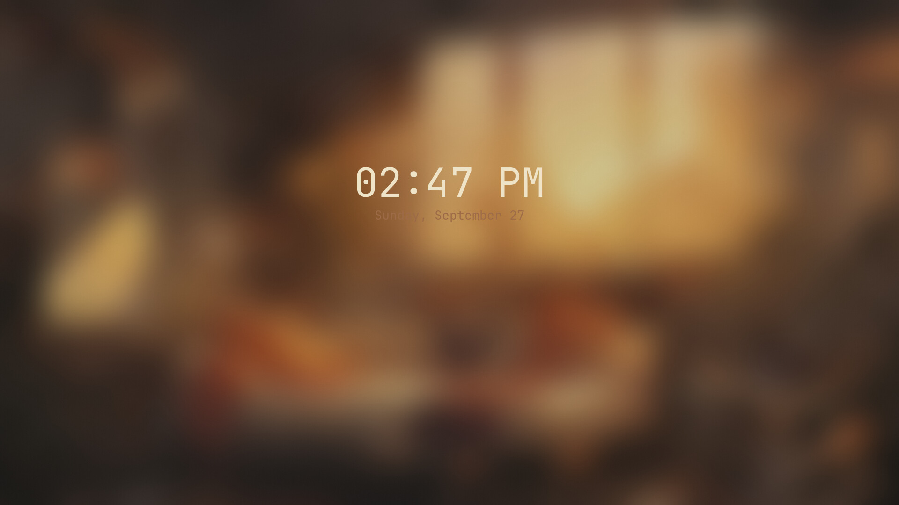
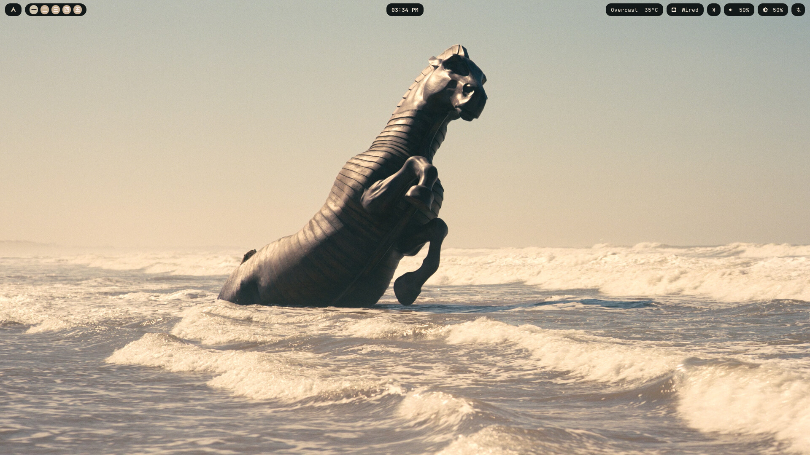
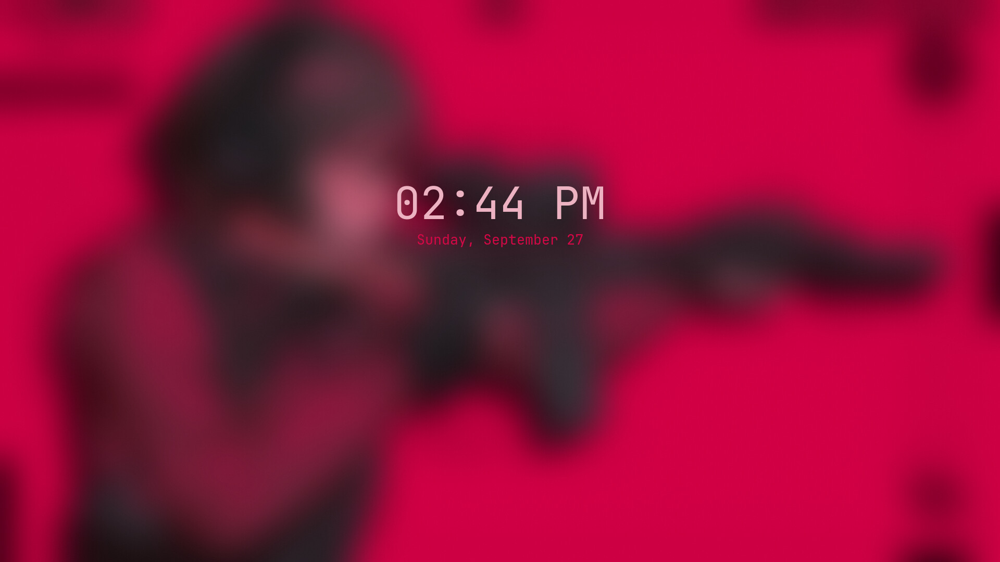
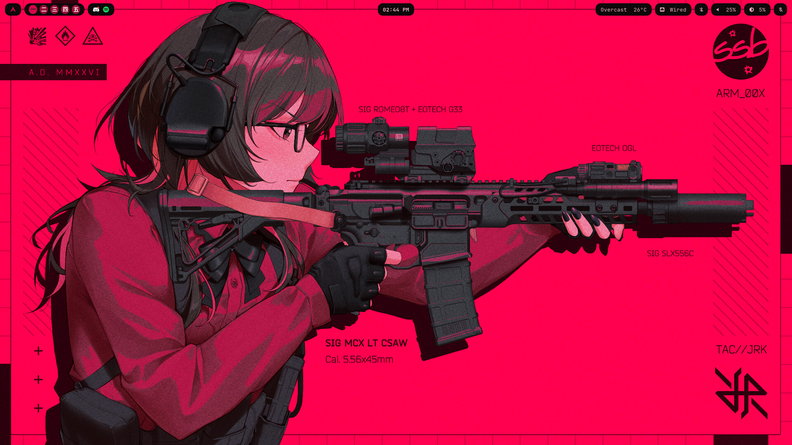

# AM's Light Dotfiles

A minimal, custom-built Hyprland rice (Lua config) with dynamic wallpaper based theming via pywal rofi, waybar, dunst, hyprlock, and kitty all shift color palette together on wallpaper change.

> [!CAUTION]
> This rice is desktop-focused. Installing it on a laptop may result in missing features (such as batt>

## Screenshots

<table>
  <tr>
    <td></td>
    <td></td>
  </tr>
  <tr>
    <td></td>
    <td></td>
  </tr>
  <tr>
    <td></td>
    <td></td>
  </tr>
  <tr>
    <td></td>
    <td></td>
  </tr>
</table>

> [!TIP]
> **Modifier Key:** <kbd>Super</kbd> refers to the **Windows / Super** key.

## Keybindings

### Applications & Launchers

| Keybinding | Action | Command |
| :--- | :--- | :--- |
| <kbd>Super</kbd> + <kbd>T</kbd> | Terminal | `kitty` |
| <kbd>Super</kbd> + <kbd>E</kbd> | File Manager | `kitty -e yazi` |
| <kbd>Super</kbd> + <kbd>R</kbd> | App Launcher | `app-launcher.sh` |
| <kbd>Super</kbd> + <kbd>V</kbd> | Clipboard History | `clipboard-menu.sh` |
| <kbd>Super</kbd> + <kbd>Shift</kbd> + <kbd>S</kbd> | Take Screenshot | `screenshot.sh` |
| <kbd>Super</kbd> + <kbd>L</kbd> | Lock Screen | `hyprlock` |
| <kbd>Alt</kbd> + <kbd>Shift</kbd> | Toggle Layout | `US` / `ARA` |

### Window Management

| Keybinding | Action |
| :--- | :--- |
| <kbd>Super</kbd> + <kbd>Q</kbd> | Close active window |
| <kbd>Super</kbd> + <kbd>Alt</kbd> + <kbd>Space</kbd> | Toggle floating mode |
| <kbd>Super</kbd> + <kbd>P</kbd> | Toggle pseudo-tiling |
| <kbd>Super</kbd> + <kbd>J</kbd> | Toggle split orientation |
| <kbd>Super</kbd> + <kbd>←</kbd> <kbd>↑</kbd> <kbd>↓</kbd> <kbd>→</kbd> | Change window focus |
| <kbd>Super</kbd> + <kbd>M</kbd> | Exit Hyprland session |

### Workspaces & Scratchpads

| Keybinding | Action |
| :--- | :--- |
| <kbd>Super</kbd> + <kbd>1</kbd> - <kbd>0</kbd> | Focus workspace 1–10 |
| <kbd>Super</kbd> + <kbd>Shift</kbd> + <kbd>1</kbd> - <kbd>0</kbd> | Move window to workspace 1–10 |
| <kbd>Super</kbd> + <kbd>S</kbd> | Toggle Special Workspace (`s`) |
| <kbd>Super</kbd> + <kbd>D</kbd> | Toggle Special Workspace (`d`) |

### Wallpapers & Theme

| Keybinding | Action |
| :--- | :--- |
| <kbd>Super</kbd> + <kbd>W</kbd> | Open Wallpaper Picker |
| <kbd>Super</kbd> + <kbd>Shift</kbd> + <kbd>W</kbd> | Apply Random Wallpaper |

### Mouse Controls

| Keybinding | Action |
| :--- | :--- |
| <kbd>Super</kbd> + <kbd>LMB</kbd> | Drag & move window |
| <kbd>Super</kbd> + <kbd>RMB</kbd> | Resize window |

## Stack
- **WM**: Hyprland (Lua config)
- **Bar**: Waybar
- **Launcher**: Rofi
- **Notifications**: Dunst
- **Lock screen**: Hyprlock + Hypridle
- **Terminal**: Kitty
- **File manager**: Yazi
- **Wallpaper**: awww
- **Color theming**: pywal
- **Clipboard**: cliphist (via systemd user services)


## One-command install

```bash
bash <(curl -fsSL https://raw.githubusercontent.com/AM-CHerno/ams-light/master/bootstrap.sh)
```

## Dependencies

Installed automatically by `install.sh`, or manually:

**Official repos:**
```bash
sudo pacman -S hyprland waybar rofi dunst hyprlock hypridle kitty yazi \
  awww python-pywal cliphist wl-clipboard grim slurp hyprpicker \
  pamixer ddcutil networkmanager bluez bluez-utils jq \
  ttf-jetbrains-mono-nerd noto-fonts-cjk qt5ct qt6ct nwg-look \
  neofetch btop task blueman kcalc pavucontrol gwenview vim mpv starship haruna discord
```

**AUR (via paru):**
```bash
paru -S --needed firefox vscodium-bin \
   gpu-screen-recorder-ui gpu-screen-recorder obsidian equicord-installer-bin neofetch nmgui-bin python-pywal arduino-ide-bin photoflare
```

## Installation

```bash
git clone https://github.com/AM-CHerno/ams-light.git ~/ams-light
cd ~/ams-light
./install.sh
```

2. Copy configs into place:
```bash
   cp -r ~/dotfiles-source/.config/* ~/.config/
   cp -r ~/dotfiles-source/.local/bin/* ~/.local/bin/
   chmod +x ~/.local/bin/*.sh ~/.local/bin/gpu-replay
```

3. Add your own wallpapers to `~/Pictures/wallpapers/`

4. Enable the clipboard services:
```bash
   systemctl --user daemon-reload
   systemctl --user enable --now cliphist-text.service cliphist-image.service
```

5. Reload Hyprland:
```bash
   hyprctl reload
```

## Notes
- All colors regenerate automatically via `apply-*-colors.sh` scripts, triggered on wallpaper change (`SUPER+SHIFT+W`) and on session start.
- Brightness control uses DDC/CI (`ddcutil`) for external monitors — adjust `getvcp`/`setvcp` codes if your monitor differs.
